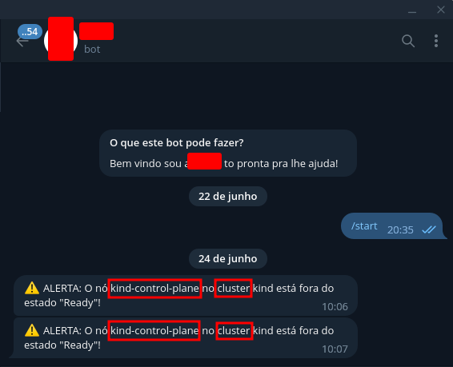

# Verificador de Status dos Nodes

Este é um programa em Go que verifica o status dos nodes em clusters Kubernetes e envia alertas via Telegram e Teams quando um node está fora do estado "Ready".

## Configuração

Antes de executar o programa, é necessário fazer algumas configurações:

1. Defina o token do bot do Telegram e o ID do chat no arquivo `main.go`:
   ```go
   var (
       webhookURLTeams = "SEU_WEBHOOK_DO_TEAMS"
       telegramBotToken = "SEU_TOKEN_DO_TELEGRAM"
       chatID           = int64(SEU_ID_DE_CHAT)
   )


O programa irá verificar periodicamente o status dos nodes em cada cluster configurado. Caso encontre algum node fora do estado "Ready", irá enviar alertas via Telegram e Teams.

## Dependências

O programa utiliza as seguintes dependências externas:

- [github.com/go-telegram-bot-api/telegram-bot-api](https://github.com/go-telegram-bot-api/telegram-bot-api): API do Telegram para Go.
- [github.com/dasrick/go-teams-notify/v2](https://github.com/dasrick/go-teams-notify/v2): Biblioteca para enviar mensagens para o Teams.


Certifique-se de instalar essas dependências antes de executar o programa:

## Executar a aplicação 

```bash
go build -o main
./main
```



## Contribuição

Contribuições são bem-vindas! Se encontrar algum problema ou tiver sugestões de melhorias, sinta-se à vontade para abrir uma issue ou enviar um pull request.

## Licença

Este projeto está licenciado sob a [MIT License](LICENSE).
